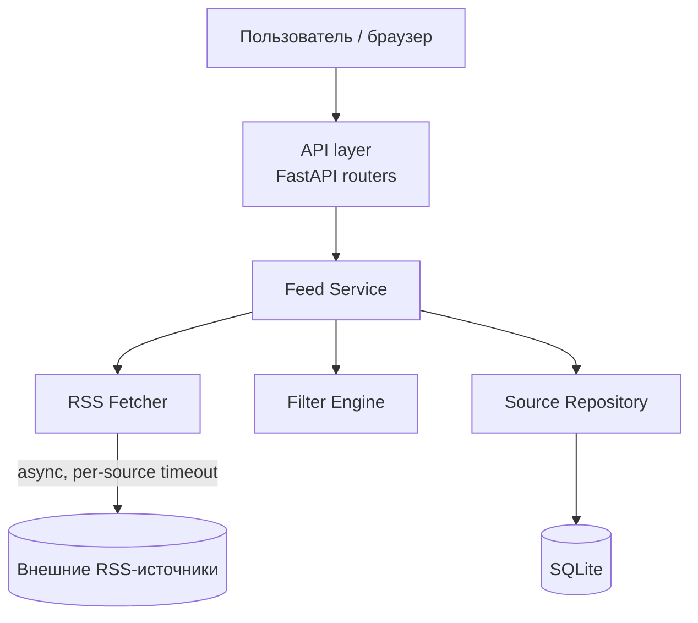

# Архитектурные драйверы и первая ADD-итерация

Система: RSS-агрегатор (см. `docs/vision.md`).

## 1. Входные данные

### Функциональные требования

1. Пользователь может добавить RSS-источник и отнести его к категории.
2. Пользователь видит единую ленту новостей из всех источников, с фильтрацией
   по ключевым словам/тегам.
3. Пользователь может пометить материал как неинтересный — это должно влиять
   на дальнейшую фильтрацию.

### Ограничения проектирования (design constraints)

1. Backend — Python + FastAPI.
2. Хранилище на старте — SQLite, без жёсткой привязки к нему в коде.
3. Продукт — веб-приложение, работающее в браузере (не десктоп/CLI).

### Сценарии атрибутов качества

#### Сценарий 1 — Производительность ленты при медленных источниках

| Элемент | Значение |
|---|---|
| Источник стимула | Пользователь |
| Стимул | Открывает главную страницу ленты, подключено ~20 источников |
| Артефакт | Feed API (эндпоинт ленты) |
| Среда | Обычная работа; 1–2 источника отвечают медленно или не отвечают |
| Реакция | Лента отдаётся без ожидания зависших источников |
| Мера реакции | Ответ ≤ 2 сек, даже если отдельный источник не отвечает 10 сек (таймаут) |

#### Сценарий 2 — Расширяемость фильтрации

| Элемент | Значение |
|---|---|
| Источник стимула | Разработчик (вы) |
| Стимул | Нужно добавить новый способ фильтрации (например, по истории чтения) |
| Артефакт | Модуль фильтрации в доменном слое |
| Среда | Время разработки |
| Реакция | Новый фильтр добавляется как отдельный модуль, без правок существующих |
| Мера реакции | Изменения затрагивают ≤ 2 файлов; API-слой и UI не меняются |

#### Сценарий 3 — Отказоустойчивость при сбое источника

| Элемент | Значение |
|---|---|
| Источник стимула | Внешний RSS-источник |
| Стимул | Источник возвращает ошибку, таймаут или невалидный XML |
| Артефакт | Сервис получения фидов (Fetcher) |
| Среда | Обычная работа приложения |
| Реакция | Остальные источники агрегируются как обычно; сбойный помечается «недоступен» |
| Мера реакции | Сбой одного источника не приводит к ошибке 500 и не увеличивает время ответа ленты сверх таймаута |

## 2. Итерация ADD (шаги 1–8)

**Шаг 1 — достаточность требований.** Требований и ограничений выше достаточно
для первой итерации декомпозиции всей системы.

**Шаг 2 — выбор элемента для декомпозиции.** Первая итерация — декомпозируем
систему целиком (других элементов ещё нет).

**Шаг 3 — архитектурные драйверы (приоритеты).**

| # | Драйвер | Важность | Сложность |
|---|---|---|---|
| 1 | Сценарий 1 — Производительность | высокая | средняя |
| 2 | Сценарий 2 — Расширяемость | высокая | средняя |
| 3 | Сценарий 3 — Отказоустойчивость | высокая | низкая |
| 4 | Ограничение — FastAPI/веб | высокая | низкая |
| 5 | Ограничение — SQLite без привязки | средняя | средняя |

**Шаг 4 — выбор тактик и паттернов.**

| Драйвер | Проблема проектирования | Тактика/паттерн | Обоснование |
|---|---|---|---|
| Сценарий 1 | Медленные/зависшие источники | Асинхронный fetch (`asyncio`/`httpx`) + таймаут на источник | Один медленный источник не блокирует остальные |
| Сценарий 2 | Добавление новых способов фильтрации | Strategy для фильтров + слоистая архитектура (domain / infrastructure / api) | Новый фильтр — новый класс, а не правка существующего кода |
| Сценарий 3 | Сбой одного источника | Изоляция ошибки на уровне отдельного fetch (try/except вокруг каждого источника, а не вокруг всей ленты) | Похоже на упрощённый Circuit Breaker: сбой локализован |
| Ограничение SQLite | Замена БД в будущем | Repository pattern поверх хранилища | Domain-слой не знает, что источники хранятся именно в SQLite |

**Шаг 5 — элементы архитектуры и их обязанности.**

- **API layer** (FastAPI routers) — принимает HTTP-запросы, валидирует вход, вызывает Feed Service.
- **Feed Service** (application service) — оркестрирует получение фидов, фильтрацию и сортировку.
- **RSS Fetcher** (infrastructure) — асинхронно ходит во внешние источники, изолирует ошибки по каждому источнику.
- **Filter Engine** (domain) — набор стратегий фильтрации (ключевые слова, "неинтересно"), не зависит от API/БД.
- **Source Repository** (infrastructure) — CRUD источников/категорий поверх SQLite, скрыт за интерфейсом.

**Шаг 6 — интерфейсы элементов.**

- `Feed Service` предоставляет: `get_feed(filters) -> list[Article]`.
- `RSS Fetcher` предоставляет: `fetch(source_url, timeout) -> list[Article] | FetchError`.
- `Filter Engine` предоставляет: `apply(articles, strategy) -> list[Article]`.
- `Source Repository` предоставляет: `add_source()`, `list_sources()`, `list_by_category()`.

**Шаг 7 — проверка соответствия.** Асинхронный fetch с таймаутом закрывает
сценарий 1; Strategy + слоистость закрывают сценарий 2; изоляция ошибок на
уровне Fetcher закрывает сценарий 3; Repository закрывает ограничение по БД.

**Шаг 8 — фиксация результата.** Для следующей итерации ADD — декомпозировать
`Filter Engine` отдельно, когда дойдём до «умной» фильтрации/рекомендаций
(п. 7 дорожной карты в vision.md).

## 3. Диаграмма архитектуры (как код)

